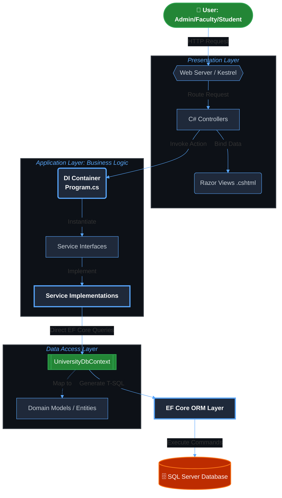
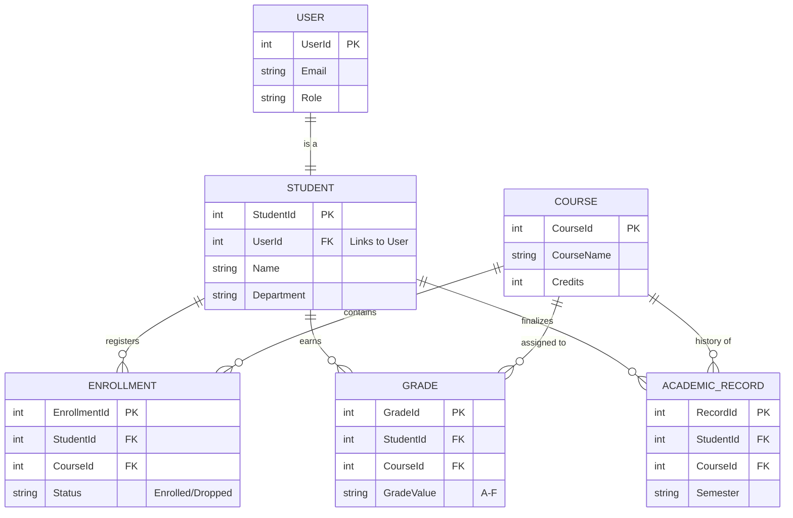

# 🎓 ABC University Management System


[](https://dotnet.microsoft.com/)
[](https://learn.microsoft.com/en-us/ef/core/)
[](https://learn.microsoft.com/en-us/aspnet/core/fundamentals/repository-pattern)

The **University Academic Management System (UAMS)** is a digital platform built to handle all the daily activities of a university in one place. Instead of using paper forms or different disconnected systems, this application brings everything together so that students, teachers, and staff can work together easily.

In simple terms, it helps the university run smoothly by:

**Helping Students**: They can register for classes, view their grades, and check their academic history online.

**Helping Teachers**: It gives them a simple way to enter grades and manage the courses they are teaching.

**Helping Staff**: It automates the "paperwork" of managing thousands of student records, making sure the information is always accurate and up-to-date.

**Keeping Data Secure**: It ensures that everyone (like a Student or an Admin) only sees the information they are allowed to see.


---

## 🏗 Architecture & Data Flow

This application uses a **Multi-Layered Architecture** to ensure strict separation of concerns, making the system highly maintainable and testable.

---

## 📊 Database Tables & Relationships
The system is built on a relational database design with strong referential integrity. I utilized Fluent API and Data Annotations to enforce business rules at the database level.


---

## ✨ Core & Advanced Features

🔐 **Role-Based Access Control (RBAC)**: Distinct dashboards and permissions for Admins, Registrars, Faculty, and Students.

🛡️ **Robust Data Validation**: Implemented strict Regex and Data Annotations for GPA entry (A-F), Student contact details, and secure password handling.

📊 **Dynamic Academic Tracking**: Real-time calculation of student enrollments and automatic history logging in the AcademicRecord table.

🔄 **Decoupled Business Logic**: All calculations (like credits/grades) are handled in the Service Layer, keeping Controllers thin and efficient.

🚀 **Code-First Migrations**: Fully version-controlled database schema management using EF Core.

## 📂 Project Structure

```
UniversityAcademicManagementSystem/
│
├── 📂 Controllers/          # Orchestrates HTTP requests and View routing
├── 📂 Services/             # Business Logic Layer (The "Brain")
│   ├── 📂 Interfaces/       # Abstractions for Dependency Injection (e.g., IStudentService)
│   └── 📂 Implementations/  # Concrete Logic and Validations
├── 📂 Repositories/         # Data Access Logic (Encapsulating EF Core queries)
├── 📂 Models/               # Domain Entities (Student, Course, User, etc.)
├── 📂 Data/                 # DbContext and Model configuration
├── 📂 Views/                # Razor UI templates organized by User Role
├── 📂 Migrations/           # EF Core Database Schema History
├── 📂 wwwroot/              # Static assets (Bootstrap, CSS, JS)
└── Program.cs               # App entry point & DI Container configuration

```

## 🚀 Getting Started

```
Prerequisites
.NET SDK (v9.0 or v10.0)

SQL Server & SSMS

Visual Studio 2022

Installation
Clone the repository:
git clone [https://github.com/Mani-741/ABC_University_Management.git](https://github.com/Mani-741/ABC_University_Management.git)
cd ABC_University_Management

Configure Connection String: Update appsettings.json with your local SQL Server instance details.

Apply Database Migrations:

PowerShell
dotnet ef database update
Run Application:

dotnet run

```
## 🔒 Security & Best Practices:
**Repository Pattern**: Ensures the DbContext is not exposed directly to the UI, allowing for easier unit testing and database swapping.

**Dependency Injection**: All services and repositories are injected via the Program.cs container to promote loose coupling.

**DTOs & ViewModels**: Used to prevent over-posting attacks and to keep domain models secure.
